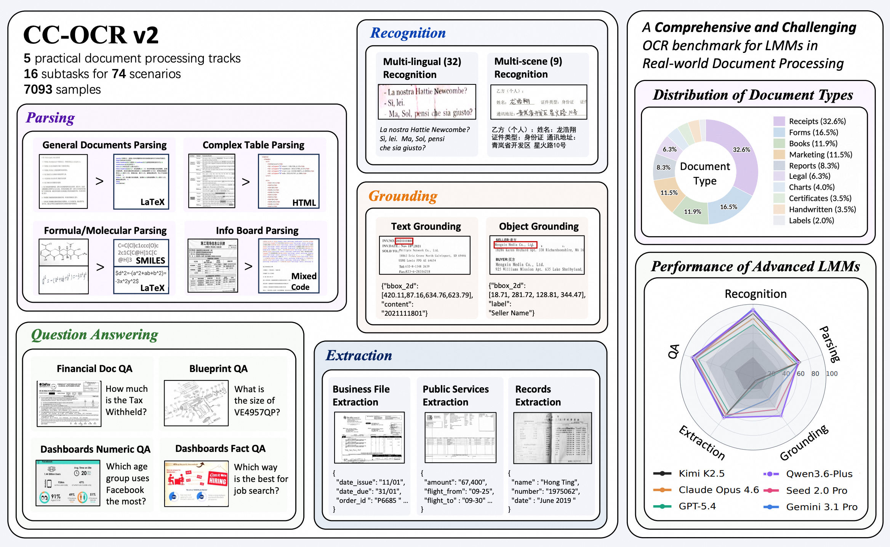
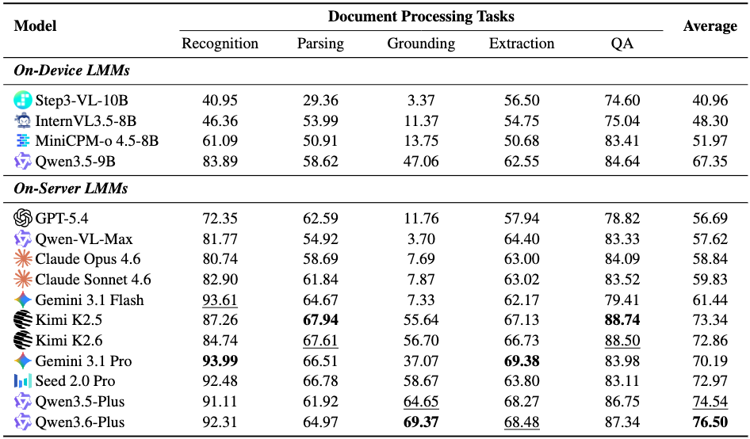
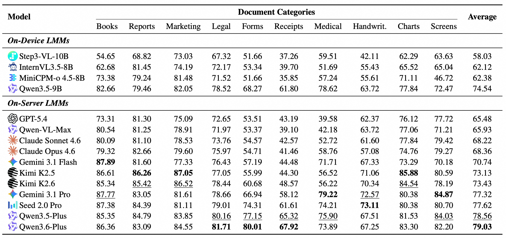

# CC-OCR V2: Benchmarking Large Multimodal Models for Literacy in Real-world Document Processing

<div align="center">

[](https://arxiv.org/abs/2605.03903)
[](https://github.com/eioss/CC-OCR-V2)
[](https://huggingface.co/datasets/Eioss/CC-OCR-V2)

</div>

<p align="center">
  <a href="#-overview"> 📖 Overview </a> •
  <a href="#-benchmark-tracks">🎯 Benchmark Tracks</a> •
  <a href="#️-setup">⚙️ Setup</a> •
  <a href="#-inference">🔧 Inference </a> •
  <a href="#-evaluation">📃 Evaluation </a> •
  <a href="#-citation">📝 Citation</a>
</p>

## 📖 Overview

Large Multimodal Models (LMMs) have recently shown strong performance on Optical Character Recognition (OCR) tasks, demonstrating their promising capability in document literacy. However, their effectiveness in real-world applications remains underexplored, as existing benchmarks adopt task scopes misaligned with practical applications and assume homogeneous acquisition conditions. 

To address this gap, we introduce **CC-OCR V2**, a comprehensive and challenging OCR benchmark tailored to real-world document processing. CC-OCR V2 focuses on practical enterprise document processing tasks and incorporates hard and corner cases that are critical yet underrepresented in prior benchmarks.



CC-OCR V2 comprises **7,093 high-difficulty samples** covering 5 major OCR-centric tracks. Extensive experiments on 14 advanced LMMs reveal that current models fall short of real-world application requirements. Even state-of-the-art LMMs exhibit substantial performance degradation across diverse tasks and scenarios.

## 🎯 Benchmark Tracks

CC-OCR V2 covers 5 major OCR-centric tracks designed to evaluate different aspects of document literacy:

1. **Text Recognition**: Evaluating the model's ability to accurately recognize text in various real-world scenarios, including multi-scene and multi-language text.
2. **Document Parsing**: Assessing the capability to parse complex document structures, including tables, formulas, and molecular structures.
3. **Document Grounding**: Testing the model's ability to ground specific text or objects within the document image.
4. **Key Information Extraction (KIE)**: Evaluating the extraction of structured key information from business transactions, public services, and regulated records.
5. **Document Question Answering (VQA)**: Assessing the model's understanding of document content through question-answering tasks.

### Overall Performance




## ⚙️ Setup

**Install dependencies**
```bash
pip install -r requirements.txt
```

## 🔧 Inference

Use the `src/request_openai.py` script to run inference on datasets using OpenAI-compatible APIs:

```bash
python src/request_openai.py \
    --ocr-root ocr_datasets/grounding/object_grounding \
    --output results/model_name \
    --model model_name \
    --api-key YOUR_API_KEY \
    --api-base YOUR_API_BASE
```

We also provide shell scripts in the `scripts/` directory to run inference for all tasks:
```bash
./scripts/run_openai_api.sh
```

## 📃 Evaluation

After running inference, evaluate the results using the evaluation script. The `src/evaluate_results.py` script acts as a unified entry point that routes to task-specific evaluators.

```bash
python src/evaluate_results.py --task <task_name> [args]
```

**Supported Tasks:**
- `recognition`
- `parsing` / `doc_parsing`
- `grounding`
- `kie`
- `vqa`

For example, to evaluate KIE results:
```bash
python src/evaluate_results.py --task kie \
    --pred_dir results/model_name/kie \
    --gt_dir ocr_datasets/extraction/answer/business_transactions
```

You can also use the provided shell scripts to evaluate all models or tasks:
```bash
./scripts/eval_all_models.sh
```

## 📝 Citation

If you find our work to be of value and helpful to your research, please acknowledge our contributions by citing us in your publications or projects:

```bibtex
@article{xu2026ccocr,
  title={CC-OCR V2: Benchmarking Large Multimodal Models for Literacy in Real-world Document Processing},
  author={Zhipeng Xu and Junhao Ji and Zulong Chen and Zhenghao Liu and Qing Liu and Chunyi Peng and Zubao Qin and Ze Xu and Jianqiang Wan and Jun Tang and Zhibo Yang and Shuai Bai and Dayiheng Liu},
  journal={arXiv preprint arXiv:2605.03903},
  year={2026}
}
```
